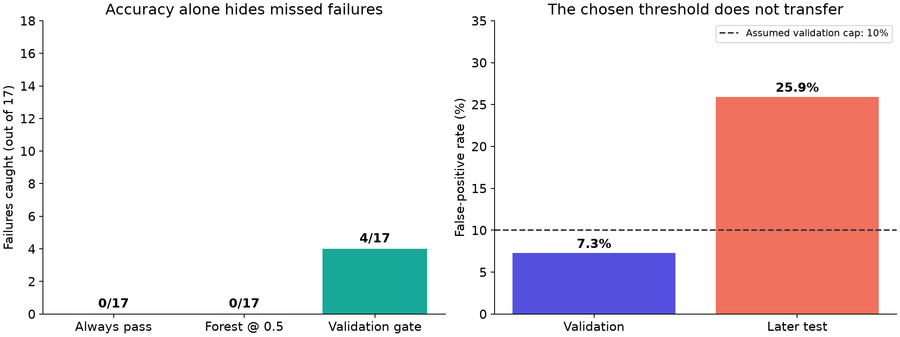

# SECOM semiconductor quality audit

**94.6% accuracy, zero failures caught.** A readable 50-line Python experiment adapting Aurelien Geron's Random Forest recipe to real semiconductor process measurements.

The later chronological test contains 314 records: 297 passes and 17 failures. The default forest predicts pass for everyone. A validation-selected threshold catches 4 failures but incorrectly flags 77 passes. This is a reproducible negative result, not a deployable quality-control solution.

| Policy | Failures caught | False alarms | Missed failures | Recall | Accuracy |
|---|---:|---:|---:|---:|---:|
| Always pass | 0 | 0 | 17 | 0% | 94.6% |
| Random Forest, threshold 0.5 | 0 | 0 | 17 | 0% | 94.6% |
| Validation-selected threshold | 4 | 77 | 13 | 23.5% | 71.3% |

The gate has 4.94% precision and 48.80% balanced accuracy (always-pass: 50%). Average precision is 0.05117; test failure prevalence is 0.05414. A lower threshold does not by itself solve this forest's poor test-set discrimination. The recipe was run as printed, with no class weighting, feature selection or tuning, so the result bounds the untuned book recipe, not Random Forests on SECOM.



## Business question
Can process measurements identify production entities needing additional review, without flooding engineers with false alarms? This experiment tests retrospective pass/fail classification. Sensor acquisition timing is undocumented, so it does not demonstrate early warning or replacement of existing factory tests. No financial savings are claimed.

## Book adaptation
Aurelien Geron, *Hands-On Machine Learning with Scikit-Learn, Keras, and TensorFlow*, second edition (O'Reilly):
- Printed p.199 / PDF p.225: RandomForestClassifier with 500 trees and maximum 16 leaves.
- Printed p.67 / PDF p.93: training-only median imputation.
- Printed pp.96-97 / PDF pp.122-123: decision scores and precision/recall threshold tradeoffs.

Our additions: SECOM data loading, timestamp-based split, fixed seed 42, single-worker execution, median-imputation pipeline with all-empty-column handling, validation-only threshold selection, explicit baselines and saved predictions. This is an adaptation, not a reproduction of the book's numerical results. The book PDF is not redistributed.

## Data and evaluation
[SECOM at UCI](https://archive.ics.uci.edu/dataset/179/secom), McCann & Johnston (2008), DOI: https://doi.org/10.24432/C54305. CC BY 4.0. Original files and hashes are under data/.

The parsed matrix has 1,567 rows and **590 sensor columns**, with 104 failures and missing values. UCI's prose describes 591 features; we report the actual matrix shape and do not silently repeat the discrepancy. Labels use -1 for pass and +1 for fail, mapped to 0 and 1.

Stable timestamp sort: 940 training, 313 validation, 314 test records, containing 76/11/17 failures. Equal timestamps are kept on one side of each boundary. Imputer and forest fit only on training data; no refit or tuning after viewing test outcomes.

Validation threshold maximizes failures caught subject to <=10% false-positive rate, tie-breaking by fewer false alarms and higher threshold. The 10% cap is an illustrative assumption. Selected threshold 0.102863 catches just 1/11 validation failures with 22/302 false alarms (7.28%). On later test data, false-positive rate is 77/297 = 25.93%. A validation constraint is not a deployment guarantee.

95% Wilson intervals: test recall 9.56-47.26%; test false-positive rate 21.27-31.19%. These assume independent records and do not account for temporal dependence. There are only 17 test failures; this small single-factory historical benchmark cannot establish general industrial performance.

## Run
Python 3.12 was used. Create a virtual environment, then:

```sh
pip install -r requirements.txt
python download_data.py
python evaluate.py
python make_report.py
```

Open report.html to view the full code and results. train.py is exactly 50 physical lines; download, verification and reporting are separate. requirements.txt records the actual tested environment. The frozen two-run audit is in .kloop/; its command uses Windows .venv/Scripts/python.exe. The portable commands above rerun the same fixed experiment without changing the historical audit.

## Verification and limitations
606 numerical checks passed, mostly training-median checks across the 590 sensor columns. This count is not 606 independent scientific experiments. Two runs produced identical prediction SHA-256: `15d4eed98a5e1dec160ba9b59424bc4375ab10b15a385a73f61360c467d1afa2`.

A separate reviewer independently recounted all confusion metrics from saved predictions and raw data, confirmed timestamp separation and hashes, and approved the arithmetic and retrospective protocol. Threshold selection was assessed from source; the reviewer did not refit the model. No deployment or improvement claim was approved. See audit/independent-review.md.

The first run failed on a quoted timestamp parsing assumption before training. Its log and fix are retained under audit/. No negative result was hidden or tuned away. The evaluator is a cooperative verification tool, not an enforced security boundary.

## Files
- train.py: full 50-line experiment
- evaluate.py and experiment_plan.md: checks and predeclared protocol
- data/: original licensed source and provenance
- results/: per-record predictions, exact metrics and uncertainty
- assets/: chart and LinkedIn infographic
- report.html: readable report and complete executed code
- .kloop/ and audit/: repeatability logs, parser failure, independent review

## Follow my work
[GitHub](https://github.com/sravanni369) | [LinkedIn](https://www.linkedin.com/in/lakshmi-sravani-p-212899272/)

Results are limited to this recorded experiment. Do not present this as a deployed factory system.
